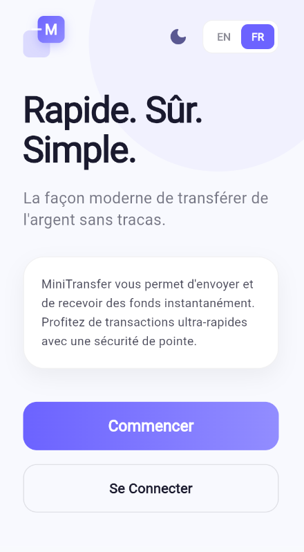

# MiniTransfer 🚀

Une plateforme simplifiée de transfert d'argent mobile construite dans le cadre du test technique TGB Solutions SARL (Réf. TGB-TT-STG-FSJ-2026-001).

MiniTransfer permet aux utilisateurs de s'inscrire, de se connecter, de consulter le solde de leur portefeuille, d'envoyer de l'argent à d'autres utilisateurs et de consulter leur historique de transactions — le tout depuis une application mobile Flutter premium, propulsée par une API REST Java/Spring Boot et une base de données MongoDB.

---

## Focus du projet

Ce projet est volontairement limité en périmètre afin de fournir une expérience mobile + backend complète et de haute qualité. Il met l'accent sur :
- une architecture propre et maintenable pour le client Flutter et l'API Spring Boot,
- un modèle NoSQL fonctionnel avec des mises à jour atomiques de solde,
- une documentation complète et des étapes de build incluant le support Docker,
- des collections Postman pour valider l'API,
- une implémentation personnelle et originale sans fonctionnalités inachevées.

Le résultat est une livraison focalisée où la qualité et la correction priment sur le volume fonctionnel.


## Choix Techniques

### Gestion d'État — Flutter
`ValueNotifier` et `ValueListenableBuilder` ont été utilisés pour la gestion d'état. Cette approche offre un moyen léger et réactif de gérer les états globaux comme le Thème et la Langue sans la complexité de bibliothèques externes.

### Modélisation MongoDB
Choix de modélisation — solde dans le document `users`

Pour ce test technique, le solde est conservé comme champ du document `users` (pas de collection `wallets` séparée). Raisons :
- Simplicité : la lecture du solde d'un utilisateur ne nécessite qu'une seule requête de document, ce qui simplifie le code client et les réponses de l'API.
- Mises à jour atomiques : les changements de solde sont appliqués avec l'opérateur `$inc` de MongoDB via `MongoTemplate`, garantissant des incréments atomiques et évitant la création ou la perte d'argent lors d'opérations concurrentes.
- Adapté au besoin : pour une application de test à petite échelle, cela évite la complexité d'une collection `wallets` séparée et la logique transactionnelle associée.

Compromis :
- Si l'application devait évoluer vers plusieurs portefeuilles par utilisateur ou exiger un registre comptable détaillé, une collection `wallets` ou un ledger serait préférable. Ce choix est volontairement hors-scope pour cet exercice.

Collections du projet :
- `users` — stocke le nom, l'email, le téléphone, le mot de passe haché et `balance` (stocké en entier, montant en FCFA)
- `transactions` — stocke l'ID de l'expéditeur, l'ID du destinataire, le montant, le statut et l'horodatage

### Devise
Tous les montants sont stockés sous forme d'entiers en FCFA pour éviter les problèmes de précision liés aux nombres à virgule flottante.

### Sécurité
Des jetons JWT sont émis lors de la connexion et validés sur chaque point de terminaison protégé via une chaîne de filtres Spring Security. Les mots de passe sont hachés avec BCrypt.

---

## Application mobile (Android prioritaire)

Le dépôt contient un client Flutter ciblant d'abord Android (iOS fourni en bonus). Notes d'implémentation et exigences :

- Écrans minimum :
  - **Inscription**
  - **Connexion**
  - **Accueil** : affiche le `balance` courant et un bouton `Transférer`
  - **Formulaire de transfert** : destinataire (email ou téléphone) + montant + confirmation
  - **Historique des transactions** : liste des transactions envoyées/reçues, triées par date décroissante

- Gestion d'état : `ValueNotifier` et `ValueListenableBuilder` sont utilisés pour l'état réactif global (thème, langue, portefeuille). Ce choix garde l'application légère et simple pour un projet de petite envergure.

- Stockage du token : les JWT sont stockés de manière sécurisée sur l'appareil. Utiliser `flutter_secure_storage` en production ; `shared_preferences` peut servir de solution de secours pour des démonstrations. Le stockage des tokens se trouve sous `mobile/storage/` dans le code.

- Expérience utilisateur et gestion des erreurs :
  - Les erreurs API sont présentées aux utilisateurs par des messages conviviaux (snackbars / dialogues).
  - Des indicateurs de chargement sont affichés pour les opérations réseau (transferts, authentification, récupération du solde).
  - La validation côté client empêche les montants invalides (≤ 0) et l'auto-transfert avant d'appeler l'API.

- Devise : les montants sont des entiers en FCFA (pas de flottants) et l'interface les affiche formatés.


## Prérequis

| Outil | Version Minimale |
|-------|------------------|
| Java (JDK) | 17 |
| Maven | 3.8+ |
| Flutter SDK | 3.10+ |
| MongoDB | 6.0+ |
| Docker & Docker Compose | 24+ (optionnel) |

---

## Installation & Lancement

### Option A — Sans Docker

#### 1. MongoDB
Assurez-vous que MongoDB fonctionne localement sur le port par défaut :
```bash
mongod --port 27017
```

#### 2. Backend (Spring Boot)
```bash
cd backend
./mvnw spring-boot:run
```
L'API sera disponible sur `http://localhost:8080`.

#### 3. Application Flutter
```bash
cd mobile
flutter pub get
flutter run
```
Assurez-vous qu'un émulateur Android est en cours d'exécution ou qu'un appareil physique est connecté.

---

### Option B — Avec Docker (Bonus)

Depuis la racine du dépôt, lancez :
```bash
docker-compose up --build
```

Cela démarre :
- MongoDB sur le port `27017` (port hôte `27018` si `27017` est déjà utilisé localement)
- API Spring Boot sur le port `8080`
- Aperçu Flutter web sur le port `8081`

Fichiers ajoutés pour le support Docker :
- `docker-compose.yml` — définition compose à la racine du dépôt
- `backend/backend/Dockerfile` — Dockerfile pour construire l'image backend
- `mobile/Dockerfile` — Dockerfile pour construire l'aperçu Flutter web
- `.env.example` — exemple de variables d'environnement pour le développement local

Le service backend lit la configuration MongoDB depuis des variables d'environnement et utilise la base par défaut `minitransfer`.
Pour utiliser l'exemple de fichier d'environnement, copiez `.env.example` en `.env` avant d'exécuter Docker.
L'application Flutter peut maintenant être aperçue en version web via le service `mobile-web` sur `http://localhost:8081`.

Pour arrêter les conteneurs :
```bash
docker-compose down
```

## Démo vidéo

Clique sur l’image ci-dessous pour ouvrir la vidéo de démonstration.

> Note : GitHub ne prévisualise pas toujours les fichiers MP4 volumineux. Si la vidéo ne s’affiche pas, clique sur le lien pour la télécharger ou l’ouvrir.

[](./20260627-1046-12.2522141.mp4)

---

Exemple de `docker-compose.yml` (à titre indicatif) :

```yaml
services:
  mongodb:
    image: mongo:6
    ports: ["27017:27017"]
  backend:
    build: ./backend
    ports: ["8080:8080"]
    depends_on: [mongodb]
```

---

## Points de terminaison API (Endpoints)

URL de base : `http://localhost:8080`

Tous les points de terminaison, sauf `/api/auth/**`, nécessitent l'en-tête :
```
Authorization: Bearer <token>
```

---

### POST /api/auth/register
Enregistrer un nouvel utilisateur. Un portefeuille avec 10 000 FCFA est créé automatiquement.

**Requête :**
```json
{
  "name": "Jorel Nguemo",
  "email": "jorel@example.com",
  "phone": "699000000",
  "password": "secret123"
}
```

**Réponse `201 Created` :**
```json
{
  "id": "664f1a2b3c4d5e6f7a8b9c0d",
  "name": "Jorel Nguemo",
  "email": "jorel@example.com",
  "phone": "699000000",
  "balance": 10000
}
```

---

### POST /api/auth/login
S'authentifier et recevoir un jeton JWT.

**Requête :**
```json
{
  "email": "jorel@example.com",
  "password": "secret123"
}
```

**Réponse `200 OK` :**
```json
{
  "token": "eyJhbGciOiJIUzI1NiIsInR5cCI6IkpXVCJ9..."
}
```

---

### GET /api/wallet/balance
Obtenir le solde actuel de l'utilisateur authentifié.

**Réponse `200 OK` :**
```json
{
  "balance": 10000
}
```

---

### POST /api/transfers
Envoyer de l'argent à un autre utilisateur (identifié par email ou numéro de téléphone).

**Requête :**
```json
{
  "senderEmail": "jorel@example.com",
  "receiverEmail": "alice@example.com",
  "amount": 2500
}
```

**Réponse `200 OK` :**
```json
{
  "id": "664f1a2b3c4d5e6f7a8b9c0e",
  "senderId": "664f...",
  "receiverId": "664f...",
  "amount": 2500,
  "status": "SUCCESS",
  "createdAt": "2026-06-25T10:30:00"
}
```

---

### GET /api/transfers/history
Obtenir l'historique complet des transactions de l'utilisateur authentifié (envoyées et reçues), trié par date décroissante.

---

## Structure du Projet

```text
minitransfer/
├── backend/                  # Projet Spring Boot
│   ├── Dockerfile            # Backend container build file
│   ├── src/main/java/com/minitransfer/backend/
│   │   ├── config/           # Configuration Sécurité & CORS
│   │   ├── controller/       # Contrôleurs REST (Auth, Wallet, Transfer)
│   │   ├── dto/              # Objets de Transfert de Données (DTO)
│   │   ├── model/            # Documents MongoDB (User, Transaction)
│   │   ├── repository/       # Répertoires Spring Data MongoDB
│   │   ├── security/         # Filtre JWT & utilitaires
│   │   └── service/          # Services de logique métier
│   ├── Dockerfile
│   └── pom.xml
├── mobile/                   # Application Mobile Flutter
│   ├── lib/
│   │   ├── config/           # Constantes et configuration statique
│   │   ├── models/           # Modèles de données (User, Transaction, etc.)
│   │   ├── screens/          # Écrans UI (Welcome, Login, Home, etc.)
│   │   ├── services/         # Services API, Langue, Thème et Portefeuille
│   │   ├── storage/          # Persistance locale (TokenStorage)
│   │   ├── widgets/          # Composants UI réutilisables & Logo redessiné
│   │   └── main.dart         # Point d'entrée & fournisseurs de Thème/Locale
│   └── pubspec.yaml
├── docker-compose.yml
└── README.md
```

---

*Développé par OMBANG Yvan Jorel — Test Technique TGB Solutions SARL — Juin 2026*

---

## Limites connues et fonctionnalités inachevées

- Les transferts échoués pour des raisons métier ne sont pas sauvegardés dans la collection `transactions` — seules les transactions réussies sont persistées. C'était un choix délibéré pour garder l'historique concis, mais cela signifie que certains échecs ne sont pas enregistrés pour l'audit.
- L'application a été prioritairement testée sur Android ; le support iOS est inclus mais n'a pas été entièrement validé sur matériel réel.
- Il n'existe pas de suite de tests automatisés complète (unitaires/intégration) pour le backend ou le client mobile, par manque de temps.
- Des fonctionnalités avancées comme le multi-portefeuilles, un grand livre d'écriture (ledger), des clés d'idempotence pour les appels API, la limitation de débit ou une architecture haute-disponibilité n'ont pas été implémentées et sont hors-scope pour ce test.

L'honnêteté sur les limites est volontaire : la livraison privilégie une surface fonctionnelle petite, documentée et correcte plutôt qu'un grand ensemble de fonctionnalités inachevées.

## Temps approximatif passé

| Phase | Temps |
|-------|------|
| Backend (API, sécurité, logique métier) | ~3 jours |
| Flutter (écrans, navigation, intégration API) | ~2 jours |
| Débogage (CORS, mise à jour de solde, émulateur) | ~1 jour |
| README & nettoyage | ~2 heures |
| **Total** | **~6 jours** |

